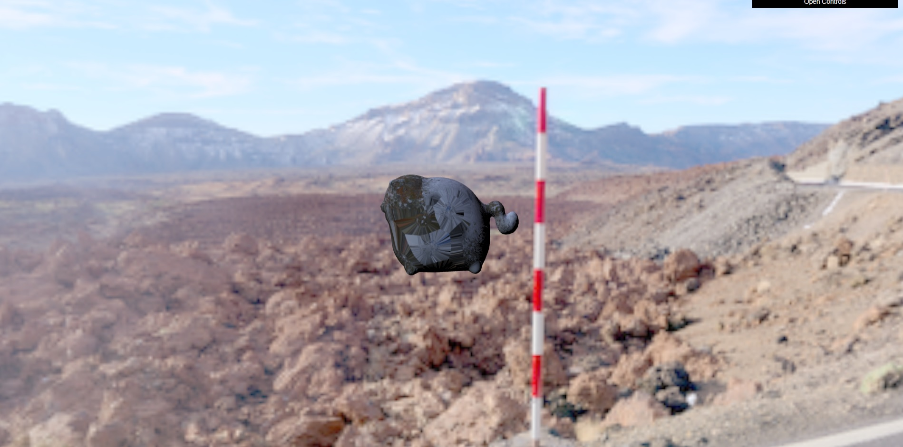
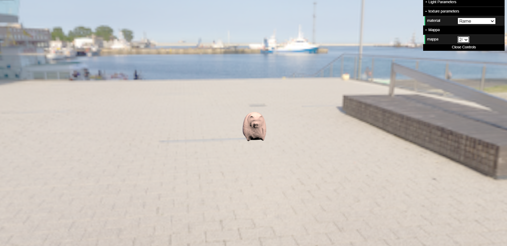

# ProductVisualization - Nerelli

# productVisualizator Nerelli

Ho scelto di prendere questo <a href="https://sketchfab.com/3d-models/cat-statue-4f32fb314d5246babd75994e5894796e">modello</a>, in quanto molto semplice e leggero.
Ho compresso le texture e aggiunto il modello su three.js con GLTFLoader, ho aggiunto due luci direzionali regolabili da uno slider che fanno riflettere il materiale direttamente da uno shader. Ho aggiunto due environmentMap e le corrispondenti irradianceMap.
Ho costruito un secondo materiale (rame) in Substance Painter, ho allocato il corretto valore per la riflettanza di Fresnel.
Ho provato con diversi modelli prima di scegliere questo, ma infine ho scelto questo in quanto gli altri erano un po' troppo complessi.
Ho convertito le environment map che ho trovato su internet (latlong), in cubemaps usando <a href="https://jaxry.github.io/panorama-to-cubemap/">uno strumento online</a>.
Per comprimere le texture, environmentMap e convertire queste ultime da formati .hdr a .png ho usato Photoshop, lo stesso per il tone mapping. Per calcolare una irradianceMap ho usato una funzionalità su cmftStudio.

# Credits
Il modello del gatto e le sua texture default vengono da <a href="https://sketchfab.com/3d-models/cat-statue-4f32fb314d5246babd75994e5894796e">sketchfab</a>.
