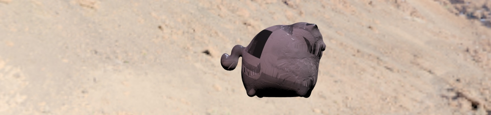
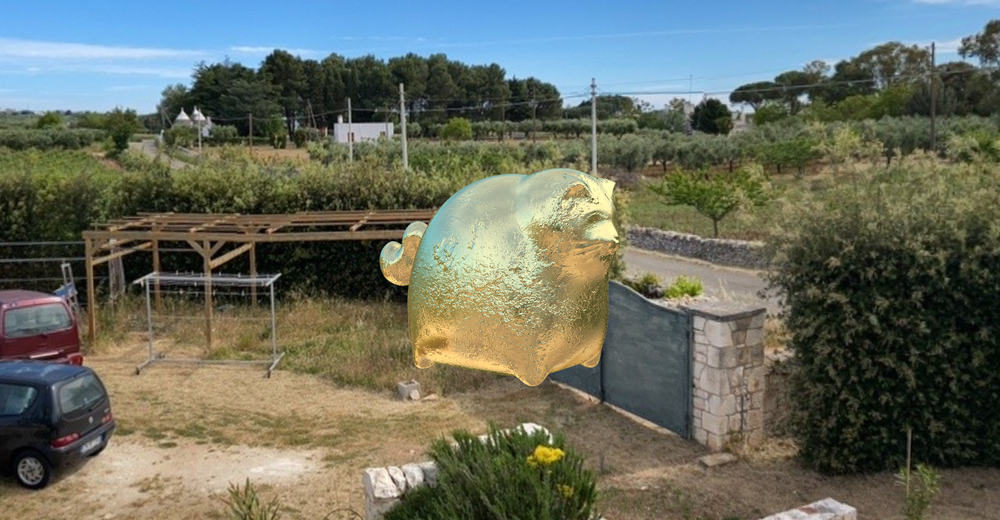

# ProductConfigurator - Nerelli

Ho scelto di prendere <a href="https://sketchfab.com/3d-models/cat-statue-4f32fb314d5246babd75994e5894796e">questo modello</a>, in quanto molto semplice e leggero.
Ho aggiunto due environmentMap prese da <a href="https://hdrmaps.com/">hdrmaps</a> e altre 5 che ho scattato io usando l'applicazione di Google Street View che consente di creare foto a 360° in un recente viaggio in Puglia.
Ho esteso due shader usati a lezione: lo shader usato nell'esempio glossyReflections per far scalare la roughness sfruttando le mipmap e sulla base di questo ho creato due materiali metallici variandone cspec e roughness: rame e oro.
Ho convertito le environment map (latlong) in cubemaps usando <a href="https://jaxry.github.io/panorama-to-cubemap/">uno strumento online</a>.
Per comprimere le texture, environmentMap e convertire le ultime da formati .hdr a .png ho usato Photoshop. Per generare le irradianceMap ho usato il software open source <a href="https://github.com/dariomanesku/cmftStudio">cmftStudio</a>.

# Credits
Il modello del gatto e le sue texture default vengono da <a href="https://sketchfab.com/3d-models/cat-statue-4f32fb314d5246babd75994e5894796e">sketchfab</a>.