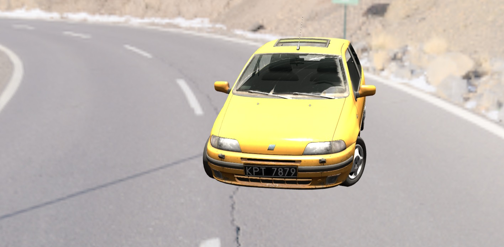

# Creazione sito
Ho creato un sito usando HTML e Bootstrap e <a href="https://getbootstrap.com/docs/4.0/examples/album/">seguendo l'esempio "album"</a> di Bootstrap.
# Scelta del modello
Ho scelto di usare <a href="https://sketchfab.com/3d-models/free-1995-fiat-punto-gt-48db6facb4b64e99b60f36b8c01185e1">questo</a> modello. L'ho scaricato e lo implemento usando gltfLoader.
# Complicazioni modello
Le texture del modello sono eccessivamente pesanti. Le ho compresse molto usando Photoshop riducendole in scala per raggiungere 12MB di texture. Il modello è inoltre molto complesso, ha 9 geometrie differenti, alle quali sono applicate più d'una texture ognuna.
# Implementazione EnvMap
Ho implementato le EnvMap trovandone due a 360° su internet, comprimendole e sfruttando cmftStudio per ottenere l'irradianceMap. Fare questa conversione non è facile, perché cmftStudio vuole soltanto alcuni tipi di latlong (tipi HDR) e devo stare attento a quando faccio il tonemapping poi con Photoshop perché non venga un'immagine "bruciata".
# Modello nella scena 

Ho aggiunto il modello nella scena, ma aggiungendone l'intera scena non riesco a utilizzare gli shader su di esso. Indagando sulla gerarchia nella scena per capire qual è la geometria di ogni oggetto, ho deciso che è più semplice importare tutto quanto con un semplice forEach su javascript, però così facendo, oltre il fatto che il modello mi appare verticale e non più orizzontale, mi viene estremamente complicato gestire i materiali.
# Caricamento modello su Substance Painter
Ho usato Substance Painter per provare a cambiare il modello. Mi sono informato sul suo funzionamento a grandi linee seguendo <a href="https://www.youtube.com/watch?v=_j27AS0VQOw">due</a> <a href="https://www.youtube.com/watch?v=4iUVOfGOxPI">tutorial</a> su YouTube. Così ho cambiato una texture al corpo della macchina e dopo averlo esportatoa mi basta caricarli.
# Difficoltà nel caricamento texture. Cambio modello.
Non è semplice caricare le texture: trovare la geometria corretta per ogni materiale e caricarne la texture corretta non è semplice. Questo mi ha portato a cambiare modello con uno più semplice.
# Scelta nuovo modello
Ho caricato il nuovo modello, ne ho individuato le geometrie, l'ho modificato su Substance Painter per ottenere una nuova texture e ho applicato le texture con uno shader.